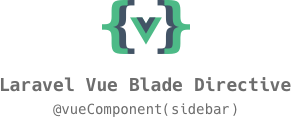

<p align="center"></p>

## What is Laravel Vue Blade Directive?

Originally inspired by [Faking Server-Side Rendering With Vue.js and Laravel by Anthony Gore](https://vuejsdevelopers.com/2017/04/09/vue-laravel-fake-server-side-rendering/), Laravel Vue Blade Directive package is meant to provide tools to build static PHP and Vue Templates in tandem.

This is not meant to replace a full SSR application, but to facilitate jankless Vue Components within Blade Templates. For example, a dynamically updated sidebar component, that is statically rendered by PHP on first load.

The goal instead is to be capable of writing a single Component in a blade file, include it with `@vueComponent(sidebar)` and have it dynamically produce both the static PHP, and the vuejs template. This will then cleanly hydrate on the Vue instance with no jank.


## Proof Of Concept Demo

[Original POC Repo](https://github.com/unr/laravel-vue-hydrate)


## Installation

You can install the package via composer:

```bash
composer require lootmarket/laravel-vue-blade-component
```

### Provider

Then add the ServiceProvider to your `config/app.php` file:

```php
'providers' => [
    ...

    LootMarket\VueComponent\VueComponentServiceProvider::class

    ...
];
```

## How to Use Laravel Vue Blade Directive

### Guides

1. [A Simple Vue Instance](docs/simple-vue-instance.md)

### Documentation

Super lighteweight documentation below. Please let us know if there's something more descriptive you needed.

#### `@vueComponent(<component-path>)`

Blade Directive for rendering our Vue Components. 

**component-path** is currently a filename for a blade component. Does not support subfolders at this time.

usage example:

```blade
@vueComponent(app)

this loads resources/views/app.blade.php
```

Templates loaded via `@vueComponent` will have `$vue` passed to them as a boolean. Additionally, they will be pushed to a [stack](https://laravel.com/docs/5.4/blade#stacks) called `vue`


#### `@vue(<jsVariable>, <phpVariable>)`

Blade Directive for displaying `{{ variableFromVueJS }}` or `$phpVariable` written to dom. This is used within a `@vueComponent` file.

If `$vue` is true, will simply echo out the php variable passed. If `$vue` is false, will echo out a string to be interpreted within a javascript template.

usage example:

```blade
@vue('$store.state.username', $initialState['username'])
```

When used within a `@vueComponent()` template, it will return:

the result of `<?php echo $initialState['username'] ?>` to the dom. 

the string `{{ $store.state.username }}` to the js template.

This allows us to declare a vuex variable in vue template, and echo out the initial state to the server rendered php.


#### `@v(<jsVariableString>)`

A simple blade directive for taking a string, and echoing it with `{{ string }}` to the dom. This allows us to easily write in js variables for our vue templates.

This is used by `@vue()`, but can be called directly if needed.

usage example:

```blade
@v($store.state.username)
```

this will simply return the string `{{ $store.state.username }}` to be used within vue.

#### `@stack('vue')`

This is a native function with Laravel 5.4 Blades - it will render out the js template for each component passed to `@vueComponent()`

Each component is only rendered once, not multiple times if done in a loop.


## About LootMarket

LootMarket is a development team based in Toronto, Ontario focused on creating great experiences around esports. In our quest for the ultimate PHP & Vue experience, we've created this.

## License

The MIT License (MIT). Please see [License File](LICENSE.md) for more information.
